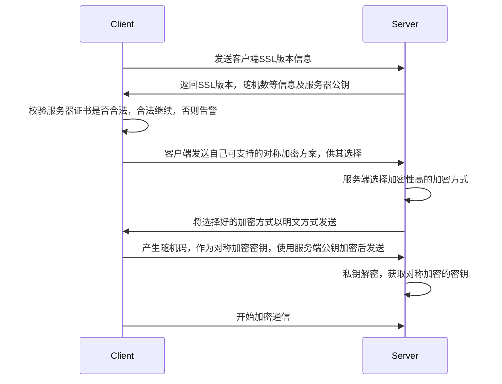
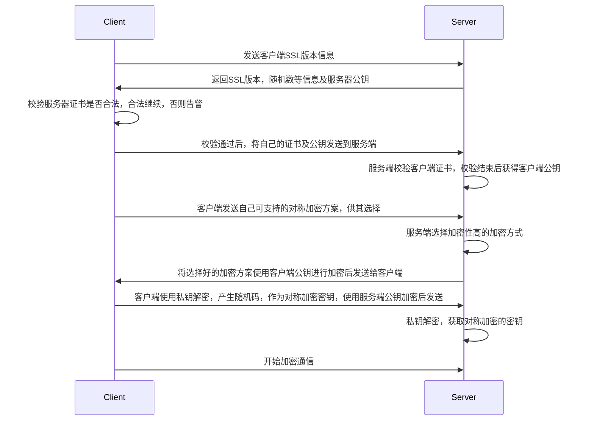

# 证书

  &nbsp;&nbsp;数字证书是Internet上唯一标识人员和资源的电子文件，证书使得两个实体之间可以安全、保密的通信。证书可以有很多类型：例如个人证书和服务器证书。任何个体/组织都可以充当CA，但难以取得client的信任。要权威的CA才行。
  &nbsp;&nbsp;证书是**基于公钥加密**的，公钥加密使用数字密钥对对信息进行加密或编码，信息只能被目标收件人读取，收件人进行解密读取

  - 公钥
    - 拥有者对公钥进行分发并使得任何人都可以使用公钥
  - 私钥

&nbsp;&nbsp;数字证书受<font color=green>**x.509**</font>格式的规范约束：要验证证书领域中某个用户的身份，验证服务将使用x.509证书的通用名称字段作为主题名称来校验x.509证书

<br/><br/>


## 分类
<br/>

### 分类1

  大家的加密效果都是一样的

  1. 加密证书

	- DV： 域名型验证

		  > 面向个体用户，安全体系较弱，验证方式：向whois的邮箱发送邮件，按照邮件通过验证即可
	- OV： 组织型验证

		  > 面向企业用户，证书在DV基础上，还需要公司授权，CA通过拨打信息库中的公司电话确认
	- EV： 扩展型验证

		  > 在OV基础上，还需要公司提供金融机构的开户许可证，要求十分严格，并且价格十分昂贵
 2. 签名证书

    - 普通签名证书
    - EV签名证书
    
    

|      | 单域名           | 多域名                                         | 泛域名         | 多泛域名                           |
| ---- | ---------------- | ---------------------------------------------- | -------------- | ---------------------------------- |
| DV   | Y                | Y                                              | N              | N                                  |
| OV   | Y                | Y                                              | Y              | Y                                  |
| EV   | Y                | Y                                              | N              | N                                  |
| 示例 | www.ss.com | www.ss.com<br />www.ss.cn<br />... | *.ss.com | *.ss.com<br />\*.ss.cn |


<br/>

### 分类2

1. `end-user`：包含用来加密传输数据公钥的证书，用于HTTPS中使用的证书

2. `intermediates`：CA用来认证公钥持有者身份的证书，可以有很多级

3. `root`：用来认证intermediates证书是合法证书的证书

   > 保证end-user证书未被篡改


<br/><br/>

## 内容校验

### 签发证书

1. 撰写证书元信息：签发人、地址、时间、失效时间等
2. 通过通用的HASH将信息摘要出来
3. Hash摘要通过CA 私钥非对称加密，生成签名密文
4. 将签名密文attach到文件证书上，变成签名过的证书


### 验证证书内容

1. 获取签发证书
2. 解压后获取"元数据"和"签名密文"
3. 使用同样的Hash数据应用到"元数据"获取摘要
4. 将密文通过CA 公钥解密获取同样的摘要
5. 比对摘要信息，完整性未被破坏则可信


<br/>
<font color=red>那如何保证公钥有效呢？即如何在SSL握手时保证收到的CA证书权威有效性呢？————————**证书链**</font>


<br/><br/>

## CA
&nbsp;&nbsp;证书由证书授权机构的可信赖第三方CA发布：将验证证书持有者的身份并对证书进行签名，使得他人无法伪造或篡改证书。任何个体/组织都可以充当CA，但难以取得client的信任。要权威的CA才行。
  证书通常包含：

  - 公钥
  - 持有者的信息
  - 发布证书的CA名称
  - 失效日期
  - 指纹及指纹算法
  - 签发者的数字签名及算法
  - 版本号
  - 序列号
  - 根证书
  - ...

  [](https://postimg.cc/y3mw29Z9)


<br/>

### 获取

1. CA付费购买
2. [let's encrypt](https://letsencrypt.org/)免费获取ssl证书
3. [openssl]()


<br/><br/>
## 证书链

- 使用end-user certificates来确保加密传输过程数据的公钥不被篡改

- 确保end-user certificates合法性，与公钥认证过程类似

  - 获取end-user certificates ca证书

  - 验证end-user certificates的签名

  - 一般来说不会直接颁发该证书，而是授权给多个二级CA，二级又可以授权给三级....

  - [Certificate Chain](https://support.dnsimple.com/articles/what-is-ssl-certificate-chain/)链式向上验证证书，直到<font color=red>**Root Certificates**</font>

    > 除了可以下载安装外，devics例如浏览器，操作系统都会内置一些root certificates(trusted root certificates);
    >
    > 客户端一般需要自己携带，自己发现如golang中发出Https请求需要解析根ca证书添加到自己的证书校验池中


   


<br/>

### 根证书

自签名

```shell
openssl genrsa -out ca.key 2048
openssl req -new -key ca.key -out ca.csr
openssl x509 -req -days 365 -in ca.csr -signkey ca.key -out ca,crt
```


<br/><br/>

## 安全套接字层SSL

  确保Internal通信和事务安全的最常见标准(例如HTTPS，基于SSL/TLS的HTTP)，HTTPS基于数字证书来确保服务器和客户机之前的安全保密通信。
  - SSL握手
    1. 浏览器通过网络发送请求安全会话的消息
    2. 服务器通过发送证书(包括公钥)进行响应
    3. 浏览器将检验服务器的证书是否有效，校验该证书是否由其证书位于浏览器数据库中的可信赖的CA签发的，并校验是否过期
    4. 证书有效，浏览器生成一个一次性唯一的会话密钥，并使有服务器的公钥对会话密钥进行加密；
    5. 浏览器将加密后的会话密钥发给服务器，服务器和浏览器都持有一份会话密钥
    6. 服务器可以使用其专用密钥对消息进行解密，恢复会话密钥
  - 开始通信


<br/><br/><br/>

# HTTPS

## 单向认证(ssl)



单向认证中，client如何校验server证书有效性的呢？


<br/><br/>


## 双向认证(ssl)

  额外增加了服务端对客户端的认证




<br/><br/>
## 数据流情况

HTTPS和HTTP一样：

1. 首先建立TCP连接
2. 建立之后不是立即发出HTTP请求所要具体资源
3. 也没有建立真实的TLS/SSL连接，只是在刚刚建立好的TCP连接上，包裹上一层加密协议而已
4. 在TLS连接协议中交换数据证书


